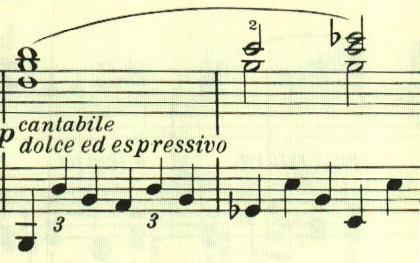
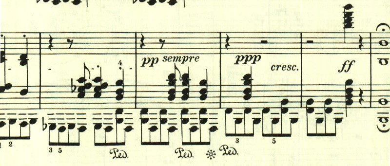

# ベートーヴェン ピアノ・ソナタ 第29番 第1楽章 「ハンマークラフィール」

<iframe allow="autoplay *; encrypted-media *;" style="width:100%;max-width:660px;overflow:hidden;background:transparent;" sandbox="allow-forms allow-popups allow-same-origin allow-scripts allow-storage-access-by-user-activation allow-top-navigation-by-user-activation" src="https://embed.music.apple.com/us/album/piano-sonata-no-29-in-b-flat-major-op-106-hammerklavier/1210861834?i=1210862289&app=music" height="150" frameborder="0"></iframe>

新しい音域の広くなったピアノを手に入れて意気込んで作曲したと言われている。
ピアノ・ソナタとしては破格の規模の大きさ。第1楽章は壮大な高くそびえる和音で始まる。

続くテーマは対照的に優しく滑らかなもの。

初期のソナタに似ていて、次々と新しいテーマが登場する。

提示部最後のテーマ。

展開部は、提示部最後のテーマで始まる。

その後は、最初のテーマがカノン風に展開される。

 

再現部。

最後は最初のテーマが繰り返されながらpppになった後に、ffの和音で終わる。

楽譜引用はヘンレ版から。
