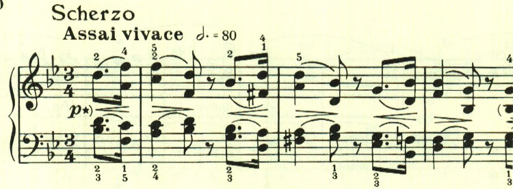
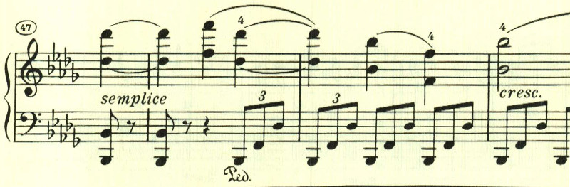
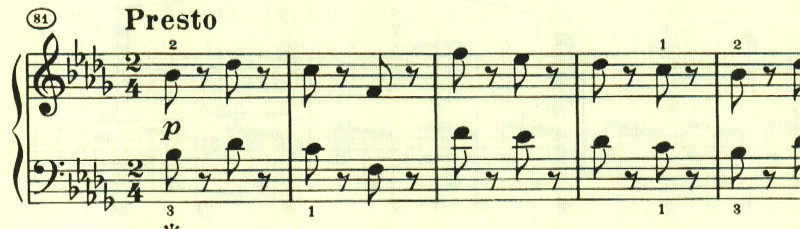
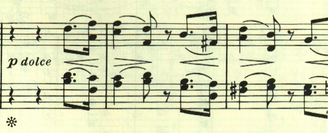
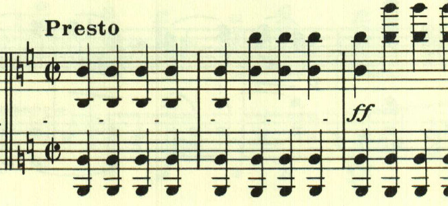

# ベートーヴェン ピアノ・ソナタ 第29番 第2楽章

<iframe allow="autoplay *; encrypted-media *;" frameborder="0" height="150" style="width:100%;max-width:660px;overflow:hidden;background:transparent;" sandbox="allow-forms allow-popups allow-same-origin allow-scripts allow-storage-access-by-user-activation allow-top-navigation-by-user-activation" src="https://embed.music.apple.com/us/album/piano-sonata-no-29-in-b-flat-major-op-106-hammerklavier/1210861834?i=1210862314&app=music"></iframe>

第29番は4楽章構成で、第2楽章にはスケルツォが配されている。

2つ目のテーマは、メロディなのかどうか分からないあやふやなもの。

突如Prestoになって流れが中断される。

最初のテーマが帰ってくる。

そして最後にもPrestoで流れが中断され、なんともスケルツォらしい。

楽譜引用はヘンレ版から。
