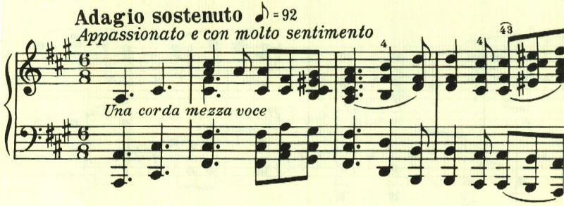

# ベートーヴェン ピアノ・ソナタ 第29番 第3楽章

<iframe allow="autoplay *; encrypted-media *;" frameborder="0" height="150" style="width:100%;max-width:660px;overflow:hidden;background:transparent;" sandbox="allow-forms allow-popups allow-same-origin allow-scripts allow-storage-access-by-user-activation allow-top-navigation-by-user-activation" src="https://embed.music.apple.com/us/album/piano-sonata-no-29-in-b-flat-major-op-106-hammerklavier/1210861834?i=1210862338&app=music"></iframe>

第3楽章は長大な緩徐楽章。最初のテーマは非常に長く、苦難に満ちた独白のようだ。

天から一筋の光が降りてくるかのようなテーマ。

長い階段を登っていくかのよう。

永遠に続く美しいもの、幸福、しかし手は届かない。

出口の見えない霞の中、あるいは深海のよう。

抗い続けるが、

不気味な影が近づく。

苦難が続く。

どれほど抗っても救われない。

あきらめのテーマが曲の終わりを告げる。

最後は長調ながらも、あきらめを感じさせるpppで終わる。

楽譜引用はヘンレ版から。
