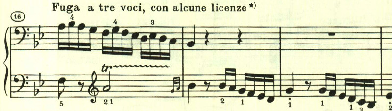
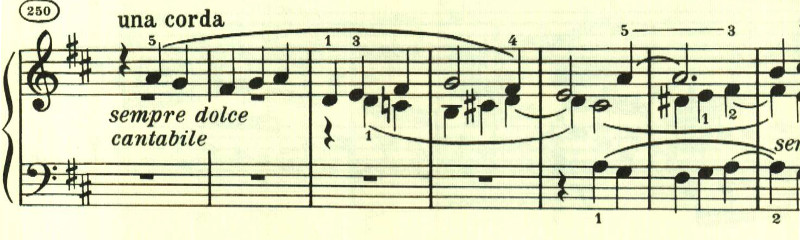

# ベートーヴェン ピアノ・ソナタ 第29番 第4楽章

<iframe allow="autoplay *; encrypted-media *;" frameborder="0" height="150" style="width:100%;max-width:660px;overflow:hidden;background:transparent;" sandbox="allow-forms allow-popups allow-same-origin allow-scripts allow-storage-access-by-user-activation allow-top-navigation-by-user-activation" src="https://embed.music.apple.com/us/album/piano-sonata-no-29-in-b-flat-major-op-106-hammerklavier/1210861834?i=1210862348&app=music"></iframe>

最終楽章は長大なフーガ。最初に長い序奏が付いている。

フーガは調性が薄く、力強く進んでいく。

印象的なカンタービレが置かれている。弱音器の指定があるだけで、強弱の指定が一切無く演奏者に任されている。最後は消えいるように終わってフーガに戻る。

最後はffの力強い和音で終わる。

楽譜引用はヘンレ版から。
