# ベートーヴェン ピアノ・ソナタ 第29番「ハンマークラフィール」

## 第1楽章

<iframe allow="autoplay *; encrypted-media *;" style="width:100%;max-width:660px;overflow:hidden;background:transparent;" sandbox="allow-forms allow-popups allow-same-origin allow-scripts allow-storage-access-by-user-activation allow-top-navigation-by-user-activation" src="https://embed.music.apple.com/us/album/piano-sonata-no-29-in-b-flat-major-op-106-hammerklavier/1210861834?i=1210862289&app=music" height="150" frameborder="0"></iframe>

新しい音域の広くなったピアノを手に入れて意気込んで作曲したと言われている。
ピアノ・ソナタとしては破格の規模の大きさ。第1楽章は壮大な高くそびえる和音で始まる。

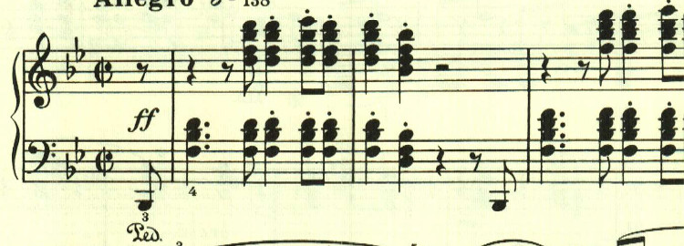

続くテーマは対照的に優しく滑らかなもの。

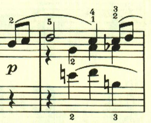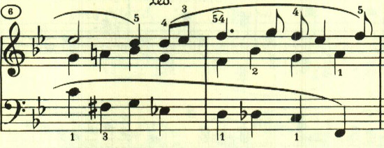

初期のソナタに似ていて、次々と新しいテーマが登場する。

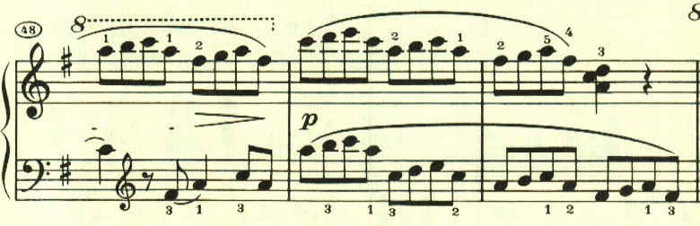

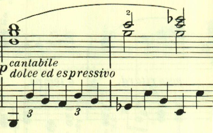

提示部最後のテーマ。

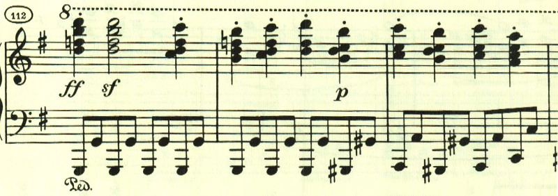

展開部は、提示部最後のテーマで始まる。

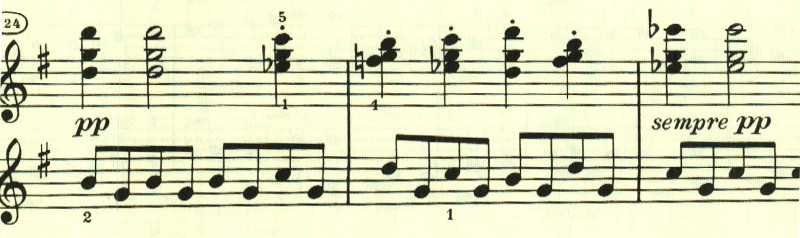

その後は、最初のテーマがカノン風に展開される。

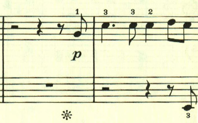 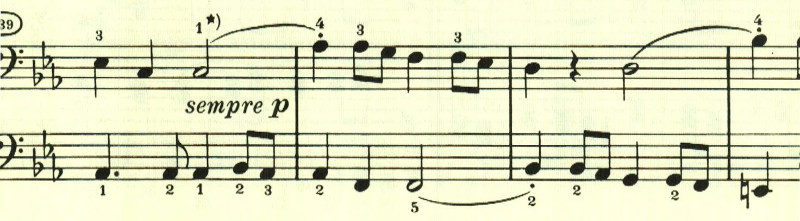

再現部。

最後は最初のテーマが繰り返されながらpppになった後に、ffの和音で終わる。

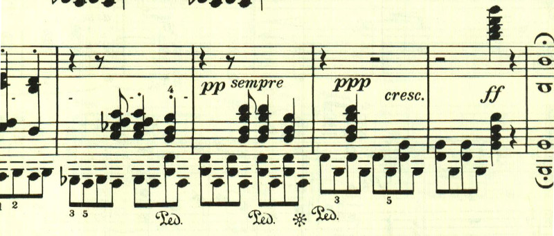

## 第2楽章

<iframe allow="autoplay *; encrypted-media *;" frameborder="0" height="150" style="width:100%;max-width:660px;overflow:hidden;background:transparent;" sandbox="allow-forms allow-popups allow-same-origin allow-scripts allow-storage-access-by-user-activation allow-top-navigation-by-user-activation" src="https://embed.music.apple.com/us/album/piano-sonata-no-29-in-b-flat-major-op-106-hammerklavier/1210861834?i=1210862314&app=music"></iframe>

第29番は4楽章構成で、第2楽章にはスケルツォが配されている。

2つ目のテーマは、メロディなのかどうか分からないあやふやなもの。

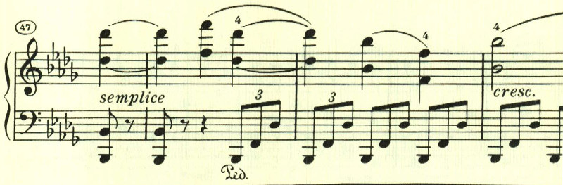

突如Prestoになって流れが中断される。

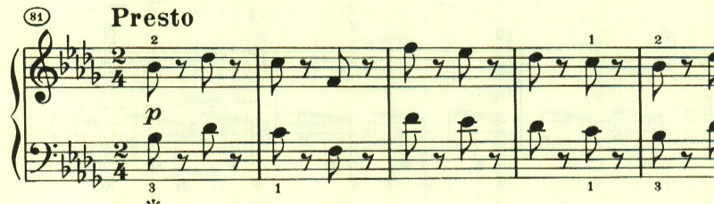

最初のテーマが帰ってくる。

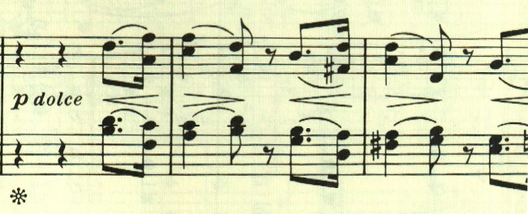

そして最後にもPrestoで流れが中断され、なんともスケルツォらしい。

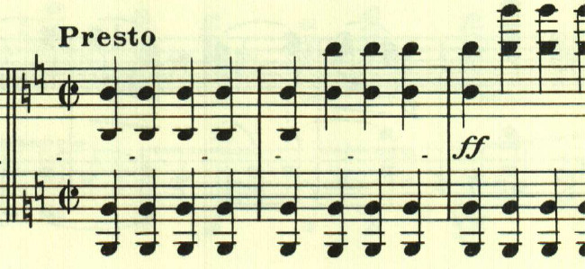

## 第3楽章

<iframe allow="autoplay *; encrypted-media *;" frameborder="0" height="150" style="width:100%;max-width:660px;overflow:hidden;background:transparent;" sandbox="allow-forms allow-popups allow-same-origin allow-scripts allow-storage-access-by-user-activation allow-top-navigation-by-user-activation" src="https://embed.music.apple.com/us/album/piano-sonata-no-29-in-b-flat-major-op-106-hammerklavier/1210861834?i=1210862338&app=music"></iframe>

第3楽章は長大な緩徐楽章。最初のテーマは非常に長く、苦難に満ちた独白のようだ。

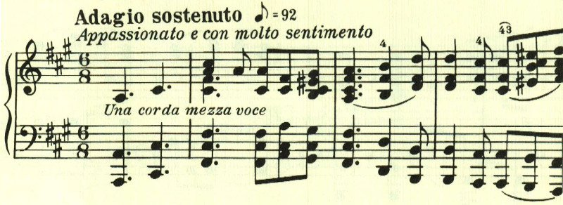

天から一筋の光が降りてくるかのようなテーマ。

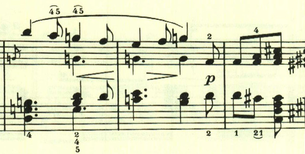

長い階段を登っていくかのよう。

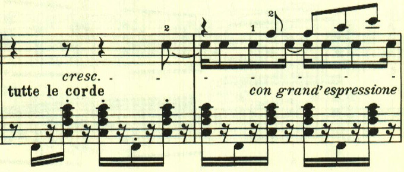

永遠に続く美しいもの、幸福、しかし手は届かない。

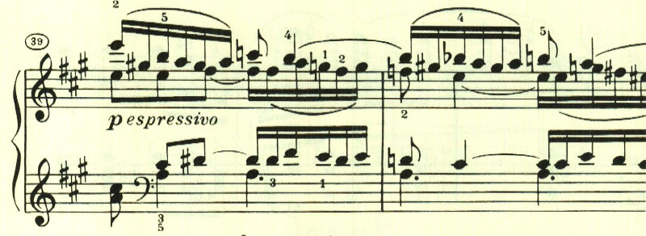

出口の見えない霞の中、あるいは深海のよう。

抗い続けるが、

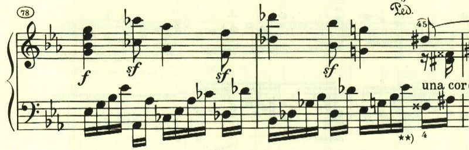

不気味な影が近づく。

苦難が続く。

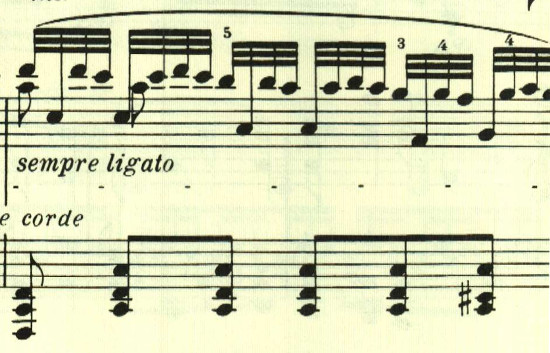

どれほど抗っても救われない。

あきらめのテーマが曲の終わりを告げる。

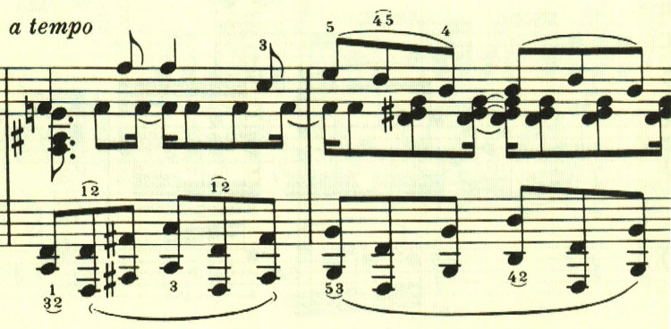

最後は長調ながらも、あきらめを感じさせるpppで終わる。

## 第4楽章

<iframe allow="autoplay *; encrypted-media *;" frameborder="0" height="150" style="width:100%;max-width:660px;overflow:hidden;background:transparent;" sandbox="allow-forms allow-popups allow-same-origin allow-scripts allow-storage-access-by-user-activation allow-top-navigation-by-user-activation" src="https://embed.music.apple.com/us/album/piano-sonata-no-29-in-b-flat-major-op-106-hammerklavier/1210861834?i=1210862348&app=music"></iframe>

最終楽章は長大なフーガ。最初に長い序奏が付いている。

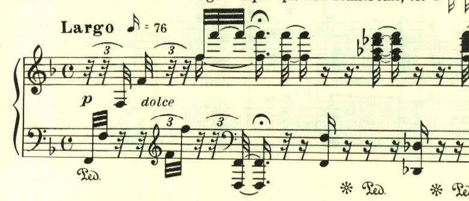

フーガは調性が薄く、力強く進んでいく。

印象的なカンタービレが置かれている。弱音器の指定があるだけで、強弱の指定が一切無く演奏者に任されている。最後は消えいるように終わってフーガに戻る。

最後はffの力強い和音で終わる。

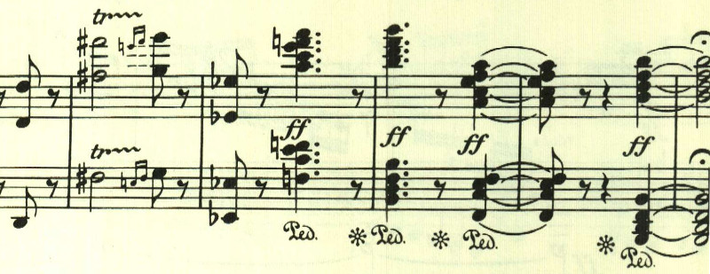

楽譜引用はヘンレ版から。
