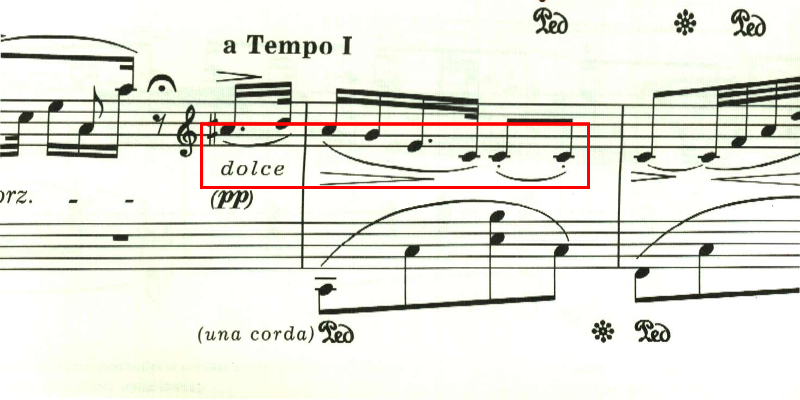
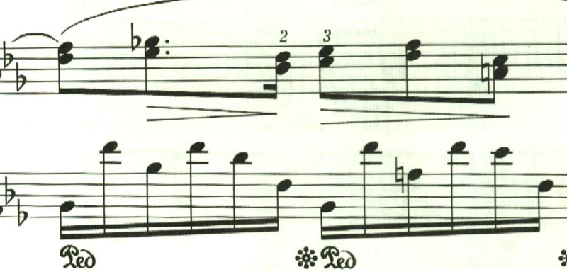
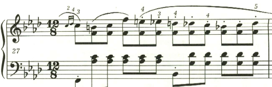
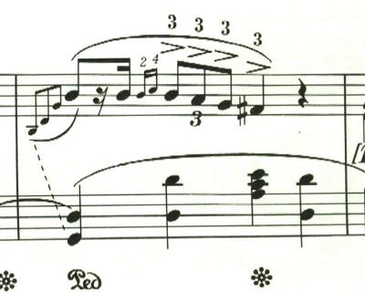
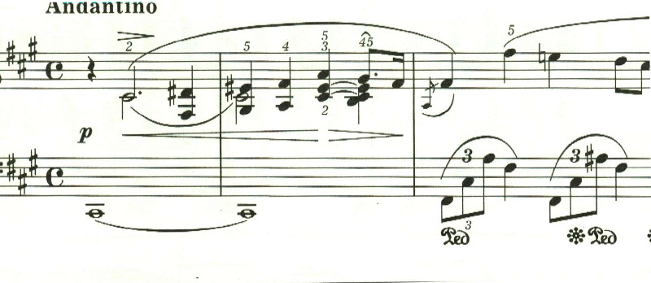
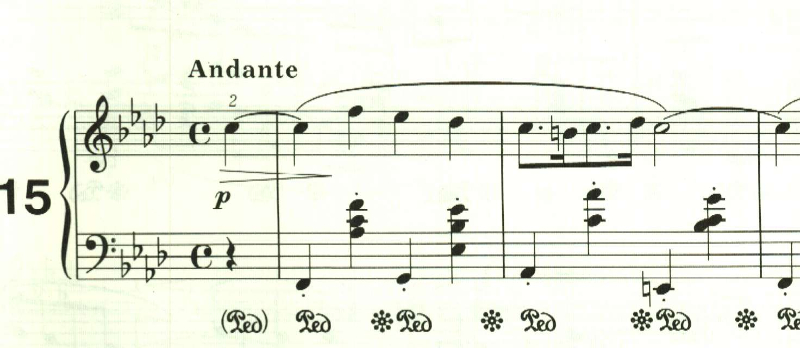
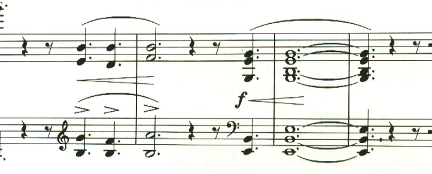
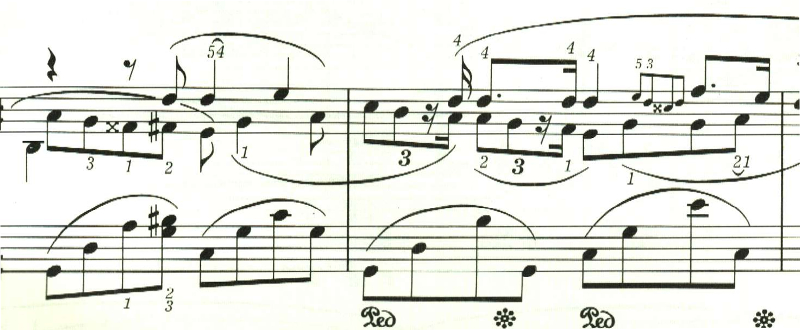
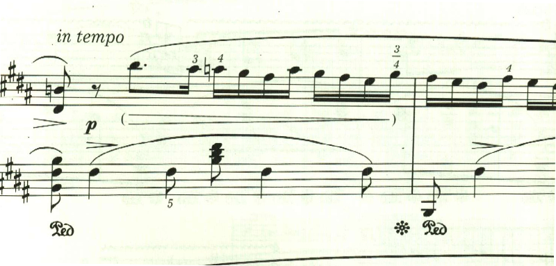
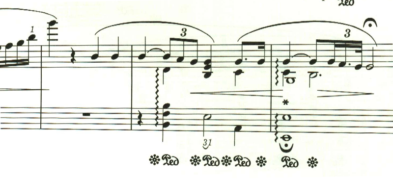

# ショパン ノクターン

## ショパン・ノクターン 第1曲 作品9-1

<iframe height="175" width="100%" title="Media player" src="https://embed.music.apple.com/us/album/nocturnes-op-9-no-1-1-larghetto-in-b-flat-minor/1196631030?i=1196631210&amp;itscg=30200&amp;itsct=music_box_player&amp;ls=1&amp;app=music&amp;mttnsubad=1196631210&amp;theme=auto" id="embedPlayer" style="border:0;border-radius:12px;width:100%;height:175px;max-width:660px" sandbox="allow-forms allow-popups allow-same-origin allow-scripts allow-top-navigation-by-user-activation" allow="autoplay *; encrypted-media *; clipboard-write"></iframe>

第1曲。全音の楽譜では、ほぼ全域でダンパーペダルを踏む指示なのだけど、エキエル版では、ごく一部にしかない。1つ目は出だし。

第1小節(弱起なので)にダンパーベダルがあるが、それっきり(Sempre指定も無し)。そして中間部も出だしにあるのみ。

特に、この中間部の右手はオクターブな上に弱音なので、ペダル無しで楽譜通りに弾くのはかなり難易度高いと思う。

## ショパン・ノクターン 第2曲 作品9-2

<iframe height="175" width="100%" title="Media player" src="https://embed.music.apple.com/us/album/nocturnes-op-9-no-2-2-andante-in-e-flat-major/1196631030?i=1196631211&amp;itscg=30200&amp;itsct=music_box_player&amp;ls=1&amp;app=music&amp;mttnsubad=1196631211&amp;theme=auto" id="embedPlayer" style="border:0;border-radius:12px;width:100%;height:175px;max-width:660px" sandbox="allow-forms allow-popups allow-same-origin allow-scripts allow-top-navigation-by-user-activation" allow="autoplay *; encrypted-media *; clipboard-write"></iframe>

ショパンのノクターンの代名詞とも言える有名な曲。

構成は単純だけど、楽譜上、作曲者の指示が非常に多く、その1つ1つをどう表現するかが腕の見せどころとなる。第1小節目、左手にはスタカート指定。

続く小節にはスタカート無し。Sempreも無しなので、第1小節だけだ。

ただダンパーペダルを踏む指示もあるので、踏み込んでスタカートとなれば聴感上はスタカートあっても無くても変わらない。なので気にしないという考えもあるだろう。実際そう弾いているピアニストも多い。しかしわざわざ、このように楽譜上の表現を変えているのだから、やはりスタカートをきちんと生かすべきだろう。つまりスタカートの部分ではダンパーペダルは、踏まないかハーフペダルとしてスタカートを生かすべきだ。

最後のクライマックスにも同様なスタカーティシモ指定。

ここもペダルを踏み込んでスタカーティシモでは違いが分からないわけで、さりとて、全くペダルを踏まずにスタカーティシモでは興醒めなので、うまい具合にハーフペダリングして軽く残響を残しつつ、スタカーティシモを表現することになる。こんな微妙なダンパーペダルの制御をリアルなピアノでやろうとしたら、普段使っているピアノを持ち歩かないと無理だろう。

ところで、ここにStrettoがあるのは今まで知らなかった、確かにこの箇所の演奏は若干テンポを上げるケースが多いなとは思っていたが、これはちゃんと楽譜に指示があったのか。

## ショパン・ノクターン第3曲 作品9-3

<iframe height="175" width="100%" title="Media player" src="https://embed.music.apple.com/us/album/nocturnes-op-9-no-3-3-allegretto-in-b-major/1196631030?i=1196631213&amp;itscg=30200&amp;itsct=music_box_player&amp;ls=1&amp;app=music&amp;mttnsubad=1196631213&amp;theme=auto" id="embedPlayer" style="border:0;border-radius:12px;width:100%;height:175px;max-width:660px" sandbox="allow-forms allow-popups allow-same-origin allow-scripts allow-top-navigation-by-user-activation" allow="autoplay *; encrypted-media *; clipboard-write"></iframe>

作品9は3つのノクターンで構成されていて、第3曲が最後。ショパンとしては、この曲は意欲作だったのではないかと思う。ショパンのノクターンは3部構成になっているものが多いけど、この曲は、その中間部の雰囲気をがらりと変えて大きな効果を得ることを狙ったのだと思う。ただ、残念ながら一般には作品9の中での知名度は最も低くなってしまった。まぁ普通の人からすると、え、何、なんでノクターンなのに、こんなに激しいの？ みたいな違和感が大きかったんだろうな。まぁ、こんな具合に作曲者が空回りしてしまうケースというのは多い。

この曲は、スタカーティシモが多用されている。面白いのはタイの後の音にスタカーティシモが付いているケースがあって、これ、どう表現するか悩みどころ。実際の演奏会なら大げさに右手を跳ね上げたりするんだろうか。

中間部。Agitatoでガンガン行く。ショパン的には「どうだ!」って感じだったのだろうな。

最後のアルペジオは、ものすごく綺麗だけど、これppで弾くのすごく難しそうで禿げそう。

## ショパン・ノクターン 第4曲 作品15-1

<iframe height="175" width="100%" title="Media player" src="https://embed.music.apple.com/us/album/nocturnes-op-15-no-1-4-andante-cantabile-in-f-major/1196631030?i=1196631214&amp;itscg=30200&amp;itsct=music_box_player&amp;ls=1&amp;app=music&amp;mttnsubad=1196631214&amp;theme=auto" id="embedPlayer" style="border:0;border-radius:12px;width:100%;height:175px;max-width:660px" sandbox="allow-forms allow-popups allow-same-origin allow-scripts allow-top-navigation-by-user-activation" allow="autoplay *; encrypted-media *; clipboard-write"></iframe>

作品15も、9に引き続き3つで構成されている。作品15の最初の曲となるこの曲は、第3曲と同じで前後を穏かな長調、中間部を激しい短調のパッセージという形式になっている。ただ第3曲よりも洗練されて、全体に簡潔にまとめらている。

中間部、第2小節はペダルを踏む指示があるけど、スタカーティシモ。どのくらいペダルを踏み込むのかが演奏者に任されている感じ。

## ショパン・ノクターン 第5曲 作品15-2

<iframe height="175" width="100%" title="Media player" src="https://embed.music.apple.com/us/album/nocturnes-op-15-no-2-5-larghetto-in-f-sharp-major/1196631030?i=1196631216&amp;itscg=30200&amp;itsct=music_box_player&amp;ls=1&amp;app=music&amp;mttnsubad=1196631216&amp;theme=auto" id="embedPlayer" style="border:0;border-radius:12px;width:100%;height:175px;max-width:660px" sandbox="allow-forms allow-popups allow-same-origin allow-scripts allow-top-navigation-by-user-activation" allow="autoplay *; encrypted-media *; clipboard-write"></iframe>

作品15の2番目も、3部構成になっているが、今度はどちらも長調になっている。第3、4曲での極端なやり方に反省して、幻想的な雰囲気を壊さないように配慮したのかもしれない。

しかし、中間部の右手の多声進行は複雑だ。

エキエル版での謎の箇所として、まず出だし

そして中間部が終わった後の出だし。この2箇所でスラーのかかり方が微妙に違う。

これが意図したものなのか、単なる間違いなのか良く分からない。ちなみに全音だと、どの箇所も以下になっている。

みんな違うし ^^;
今回の演奏では、エキエル版の最初の出だしのスラーのかかり方を正としている。
楽譜引用は、エキエル版と全音版。

## ショパン・ノクターン 第6曲 作品15-3

<iframe height="175" width="100%" title="Media player" src="https://embed.music.apple.com/us/album/nocturnes-op-15-no-3-6-lento-in-g-minor/1196631030?i=1196631217&amp;itscg=30200&amp;itsct=music_box_player&amp;ls=1&amp;app=music&amp;mttnsubad=1196631217&amp;theme=auto" id="embedPlayer" style="border:0;border-radius:12px;width:100%;height:175px;max-width:660px" sandbox="allow-forms allow-popups allow-same-origin allow-scripts allow-top-navigation-by-user-activation" allow="autoplay *; encrypted-media *; clipboard-write"></iframe>

第6曲は、これまでとは違って自由な構成になっている。最初は短調で始まり、

このあたりからクレシェンド。うまく行かない現状への怒りを思わせる。

ここから長調となり、過去の幸せな記憶を思い起こすかのような、幻想的で暖かな感じの曲調になる。

ここからは、なんとなく諦めのような、不思議な音型の繰り返しとなって、そのまま曲を閉じる。

う〜む、何か嫌なことでもあったのか。

## ショパン・ノクターン 第7曲 作品27-1

<iframe height="175" width="100%" title="Media player" src="https://embed.music.apple.com/us/album/nocturnes-op-27-no-1-7-larghetto-in-c-sharp-minor/1196631030?i=1196631218&amp;itscg=30200&amp;itsct=music_box_player&amp;ls=1&amp;app=music&amp;mttnsubad=1196631218&amp;theme=auto" id="embedPlayer" style="border:0;border-radius:12px;width:100%;height:175px;max-width:660px" sandbox="allow-forms allow-popups allow-same-origin allow-scripts allow-top-navigation-by-user-activation" allow="autoplay *; encrypted-media *; clipboard-write"></iframe>

第7曲は、再び3部構成に戻っている。出だしは深い霧に包まれた暗闇の中を進むようなアルペジオで始まる。

この曲もペダル指定の中にスタカートというのが多用されていて、ここをどう弾き分けるかが腕の見せどころとなる。中間部は、これまでと異なり出だしと同じ短調のままとなっている。

同じ旋律が繰り返されるが、符点が複符点となって緊迫感を盛り上げていく。

そして、勝利宣言のような旋律が力強く現われるが、長くは続かずに短調の闇に沈み込んでいって最初の暗いアルペジオとなる。

しかし、最後は次第に光が差してきて、明るくなったところで曲を閉じる。何か良いことがあったのかな。

## ショパン・ノクターン 第8曲 作品27-2

<iframe height="175" width="100%" title="Media player" src="https://embed.music.apple.com/us/album/nocturnes-op-27-no-2-8-lento-sostenuto-in-d-flat-major/1196631030?i=1196631219&amp;itscg=30200&amp;itsct=music_box_player&amp;ls=1&amp;app=music&amp;mttnsubad=1196631219&amp;theme=auto" id="embedPlayer" style="border:0;border-radius:12px;width:100%;height:175px;max-width:660px" sandbox="allow-forms allow-popups allow-same-origin allow-scripts allow-top-navigation-by-user-activation" allow="autoplay *; encrypted-media *; clipboard-write"></iframe>

第8曲は、これまでこだわたっていた3部形式を捨て、2つの主題を交互に組み合わせ、そこに様々な装飾を施す形式になっている。まず幻想的で甘美な主題で始まる。

2つ目は、憂いを含んでいつつも、悲壮過ぎないどこか影のある主題。

第一主題の再現は、pp。

第二主題は、今度は長調で現われる。

そして再度の第一主題。今度はffと様々に変化するが、少しも不自然さを感じさせないのはさすが。

そして、この展開で曲も終わりかと思いきや、そのまま引っぱる。

この左手の音型も曲の終わりを感じさせるが、そのまま7小節引っぱる。

最後は7連符で静かに終わる。個人的には、ショパンのノクターンで一番好きな曲。

## ショパン・ノクターン 第9曲 作品32-1

<iframe height="175" width="100%" title="Media player" src="https://embed.music.apple.com/us/album/nocturnes-op-32-no-1-9-andante-sostenuto-in-b-major/1196631030?i=1196631220&amp;itscg=30200&amp;itsct=music_box_player&amp;ls=1&amp;app=music&amp;mttnsubad=1196631220&amp;theme=auto" id="embedPlayer" style="border:0;border-radius:12px;width:100%;height:175px;max-width:660px" sandbox="allow-forms allow-popups allow-same-origin allow-scripts allow-top-navigation-by-user-activation" allow="autoplay *; encrypted-media *; clipboard-write"></iframe>

第7曲の最後で光が差して来て以降、第8、9曲と長調が続く。作品32の最初の曲は、穏やかな夢見るような旋律で始まる。

この曲で特徴的なのは、穏かな流れを断ち切るstretto。しかし、この緊張はすぐに解けて元の穏かな長調に戻る。

2つ目の主題も、夢見るような旋律。基本的にこの2つの旋律と経過句で曲は構成される。

しかし、最後に不気味な心臓の動悸のようなF音が連打され、そのまま短調で曲を閉じる。なんか「次回を乞御期待」みたいな感じ?

## ショパン・ノクターン 第10曲 作品32-2

<iframe height="175" width="100%" title="Media player" src="https://embed.music.apple.com/us/album/nocturnes-op-32-no-2-10-lento-in-a-flat-major/1196631030?i=1196631431&amp;itscg=30200&amp;itsct=music_box_player&amp;ls=1&amp;app=music&amp;mttnsubad=1196631431&amp;theme=auto" id="embedPlayer" style="border:0;border-radius:12px;width:100%;height:175px;max-width:660px" sandbox="allow-forms allow-popups allow-same-origin allow-scripts allow-top-navigation-by-user-activation" allow="autoplay *; encrypted-media *; clipboard-write"></iframe>

第9曲の最後で不気味な音型を見せつつ、第10曲は依然として明い曲で肩透し。第10曲はノクターンというより舞踏曲といった感じ。実際、管弦楽曲に編曲されて、バレエ曲「レ・シルフィード」に使われている。

曲は導入部から始まる。

3部形式が復活。中間部の第1、2小節目は音型がほぼ同じだが、スラーのかかり方が微妙に違う。ショパンの曲はこういうのが多い。

第3、4小節目も同様に、スラーのかかり方が微妙に違う。

そして最後は、導入部が繰り返されて終わる。すばらしき線対称の構成美。

## ショパン・ノクターン 第11曲 作品37-1

<iframe height="175" width="100%" title="Media player" src="https://embed.music.apple.com/us/album/nocturnes-op-37-no-1-11-andante-sostenuto-in-g-minor/1196631030?i=1196631432&amp;itscg=30200&amp;itsct=music_box_player&amp;ls=1&amp;app=music&amp;mttnsubad=1196631432&amp;theme=auto" id="embedPlayer" style="border:0;border-radius:12px;width:100%;height:175px;max-width:660px" sandbox="allow-forms allow-popups allow-same-origin allow-scripts allow-top-navigation-by-user-activation" allow="autoplay *; encrypted-media *; clipboard-write"></iframe>

第10曲まで長調が続いていたが、11曲目で短調になる。初期の意欲的な作品とは異なり、簡素な旋律で構成されている。
ここは、中指だけで弾けとの指定。全音版には無いのでエキエル版独自の指定か。

中間部は、素朴で暖かな和音進行。

最後は長調に転じて静かに曲を閉じる。

## ショパン・ノクターン第12曲 作品37-2

<iframe height="175" width="100%" title="Media player" src="https://embed.music.apple.com/us/album/nocturnes-op-37-no-2-12-andantino-in-g-major/1196631030?i=1196631433&amp;itscg=30200&amp;itsct=music_box_player&amp;ls=1&amp;app=music&amp;mttnsubad=1196631433&amp;theme=auto" id="embedPlayer" style="border:0;border-radius:12px;width:100%;height:175px;max-width:660px" sandbox="allow-forms allow-popups allow-same-origin allow-scripts allow-top-navigation-by-user-activation" allow="autoplay *; encrypted-media *; clipboard-write"></iframe>

作品37-2は、通称「舟歌」。確かに6拍子の音型は比較的流れの速い川を下っているかのようだ。しかし、曲を通して二重音のオンパレードで、これを軽やかに粒を揃えて弾くのは下手な練習曲より難しい。

次々と調が変わっていくこの曲は、フォーレを想起させるが、もちろん時代的に言えば、こちらの曲の方が先なわけで、もしかしたらフォーレが参考にしたのかもしれない。この次第に調が失われていくところも、段々と色彩が消えていくようで趣深い。

もう1つの主題は素朴で暖い音型で、例によって三部形式かと思いきや、2つの主題が交互に表れる形式になっている。

最後の部分。ここの推移も見事だ。

そして2つ目の主題が少しだけ表れて静かに曲を閉じる。

## ショパン・ノクターン 第13曲 作品48-1

<iframe height="175" width="100%" title="Media player" src="https://embed.music.apple.com/us/album/nocturnes-op-48-no-1-lento-in-c-minor/1234807634?i=1234807637&amp;itscg=30200&amp;itsct=music_box_player&amp;ls=1&amp;app=music&amp;mttnsubad=1234807637&amp;theme=auto" id="embedPlayer" style="border:0;border-radius:12px;width:100%;height:175px;max-width:660px" sandbox="allow-forms allow-popups allow-same-origin allow-scripts allow-top-navigation-by-user-activation" allow="autoplay *; encrypted-media *; clipboard-write"></iframe>

第13曲は、ゆっくりと歩みを進めるようなパッセージで始まる。日本人的には、なんか演歌のようなテーマ。もちろん時代的に考えれば、こちらの方が先なのだろうが。

ここで長調となって新しいテーマが現われる。霧の中、あるいは水の中を進むかのようだ。

次第に激しい半音階を主とした進行になりクライマックスを迎える。何かあらがえない力に、なすすべもなく流されていくかのようだ。

ここで最初のテーマが返ってくるが、かなりの展開が行われている。ショパンの後期のノクターンは、複雑な主題の展開がなされることが増えてくる。

最後は劇的な転調で終わる。

楽譜引用は、エキエル版から。

## ショパン・ノクターン 第14曲 作品48-2

<iframe height="175" width="100%" title="Media player" src="https://embed.music.apple.com/us/album/nocturnes-op-48-no-2-andantino-in-f-sharp-minor/1234807634?i=1234807638&amp;itscg=30200&amp;itsct=music_box_player&amp;ls=1&amp;app=music&amp;mttnsubad=1234807638&amp;theme=auto" id="embedPlayer" style="border:0;border-radius:12px;width:100%;height:175px;max-width:660px" sandbox="allow-forms allow-popups allow-same-origin allow-scripts allow-top-navigation-by-user-activation" allow="autoplay *; encrypted-media *; clipboard-write"></iframe>

第14曲は、不安を抱えているような、焦っているような、憂鬱な旋律で始まる。

中間部は長調で始まるが、すっきりとしない。無理に明るく振る舞っているような、諦めているような。

最初の主題が返ってきて、最後は不安に沈んだトリルで終わる。

楽譜引用はエキエル版

## ショパン・ノクターン 第15曲 作品55-1

<iframe height="175" width="100%" title="Media player" src="https://embed.music.apple.com/us/album/nocturnes-op-55-no-1-andante-in-f-minor/1234807634?i=1234807639&amp;itscg=30200&amp;itsct=music_box_player&amp;ls=1&amp;app=music&amp;mttnsubad=1234807639&amp;theme=auto" id="embedPlayer" style="border:0;border-radius:12px;width:100%;height:175px;max-width:660px" sandbox="allow-forms allow-popups allow-same-origin allow-scripts allow-top-navigation-by-user-activation" allow="autoplay *; encrypted-media *; clipboard-write"></iframe>

第15曲は諦めのような旋律が淡々と進む。

初期の頃は、中間部は、それまでと大きく異なる素材を展開する事が多かったが、第15曲では、中間部は同じ短調で構成される。

やはり焦りを感じさせる旋律が続く。この旋律は最初の旋律と似ている。

最初の旋律が再現された後は、3連符のパッセージがアチェランドしながら高音域に上っていく。あたかも天に昇っていくかのよう、あるいは何か浄化されていくかのようだ。

最後は力強い長調の和音で終わる。大丈夫、大丈夫と自分に言い聞かせているかのようだ。

楽譜引用は、エキエル版から。

## ショパン・ノクターン 第16曲 作品55-2

<iframe height="175" width="100%" title="Media player" src="https://embed.music.apple.com/us/album/nocturnes-op-55-no-2-lento-sostenuto-in-e-flat-major/1234807634?i=1234807640&amp;itscg=30200&amp;itsct=music_box_player&amp;ls=1&amp;app=music&amp;mttnsubad=1234807640&amp;theme=auto" id="embedPlayer" style="border:0;border-radius:12px;width:100%;height:175px;max-width:660px" sandbox="allow-forms allow-popups allow-same-origin allow-scripts allow-top-navigation-by-user-activation" allow="autoplay *; encrypted-media *; clipboard-write"></iframe>

第16曲は、第15曲とは対照的な、秋の快晴を思わせる爽やかなテーマで始まる。

途中、憂いを含んだ旋律も現れるが、曲は終始明るい光に包まれる。

曲のクライマックス。エキエル版はで興味深い強弱とスラーのかけ方が試みられている。

ちなみに、過去の全音版では、このようになっており、該当の音はスラーの途中音に過ぎない。

エキエル版の表現だと、該当の音の箇所で、ふわりと宙に浮くような感じとなり、なんとも幻想的だ。
この曲も最後は、力強い長調の和音で終わる。自分自身を元気付けているかのようだ。

楽譜引用は、エキエル版と全音版から

## ショパン・ノクターン 第17曲 作品62-1

<iframe height="175" width="100%" title="Media player" src="https://embed.music.apple.com/us/album/nocturnes-op-62-no-1-andante-in-b-major/1234807634?i=1234807641&amp;itscg=30200&amp;itsct=music_box_player&amp;ls=1&amp;app=music&amp;mttnsubad=1234807641&amp;theme=auto" id="embedPlayer" style="border:0;border-radius:12px;width:100%;height:175px;max-width:660px" sandbox="allow-forms allow-popups allow-same-origin allow-scripts allow-top-navigation-by-user-activation" allow="autoplay *; encrypted-media *; clipboard-write"></iframe>

第17曲も、長調の明るいテーマで始まる。

これがショパンのノクターンなのかと思うくらい多声的で、初期の作品からは想像もつかない。ショパンがもっと長生きしていたら、この後、どのような変貌を遂げたのだろうか。

明るかったテーマは次第に影に覆われて消えていき、最後に一陣の風が吹き抜ける。

新しいテーマも長調だが、リズミカルなものを登場させることで見事な対比を作り出している。

新しいテーマが終わると、長いトリルが続き、とめどない思いがつづられていく。

前半同様に曲は、影に覆われ消えいるように色彩を失っていく。

この曲も最後は長調で終わるものの、第16曲のような力強さく、消え入るように終わる。

## ショパン・ノクターン 第18曲 作品62-2

<iframe height="175" width="100%" title="Media player" src="https://embed.music.apple.com/us/album/nocturnes-op-62-no-2-lento-in-e-major/1234807634?i=1234807642&amp;itscg=30200&amp;itsct=music_box_player&amp;ls=1&amp;app=music&amp;mttnsubad=1234807642&amp;theme=auto" id="embedPlayer" style="border:0;border-radius:12px;width:100%;height:175px;max-width:660px" sandbox="allow-forms allow-popups allow-same-origin allow-scripts allow-top-navigation-by-user-activation" allow="autoplay *; encrypted-media *; clipboard-write"></iframe>

第18曲は穏かなテーマで始まる。このテーマは何度か繰り返され、普段通りの生活を思わせる。あるいは、叶わぬ未来への憧憬を思わせる。

低音部から何かが近づいてくるかのようなパッセージが繰り返される。

これは本当にノクターンなのか。多声的な展開が続く。あるいは後期の作品では、旋律的な最初のテーマと、多声的なテーマとで対比を作り出すことを狙っていたのかもしれない。こうした多声的なテーマは、逆らうことのできない運命の流れを感じさせる。

最初のテーマが戻ってくる。

通常なら、ここで終わるところだが、執拗に低音部から不気味なパッセージが近づいてくる。

最初の時のような勢いは無く、靜かに曲を閉じる。

楽譜引用はエキエル版

## ノクターン 遺作(WN23)

<iframe height="175" width="100%" title="Media player" src="https://embed.music.apple.com/us/album/nocturnes-wn-23-andante-in-e-minor/1234807634?i=1234807643&amp;itscg=30200&amp;itsct=music_box_player&amp;ls=1&amp;app=music&amp;mttnsubad=1234807643&amp;theme=auto" id="embedPlayer" style="border:0;border-radius:12px;width:100%;height:175px;max-width:660px" sandbox="allow-forms allow-popups allow-same-origin allow-scripts allow-top-navigation-by-user-activation" allow="autoplay *; encrypted-media *; clipboard-write"></iframe>

エキエル版で、WN23という番号が振られた遺作。基本的に最初のテーマの繰り返しで、初期のノクターンに似ている。

楽譜引用はエキエル版

