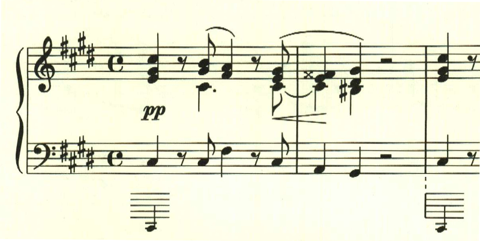
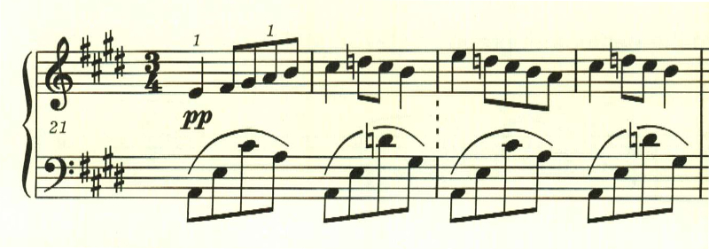
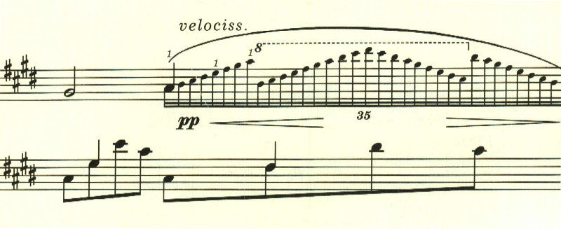
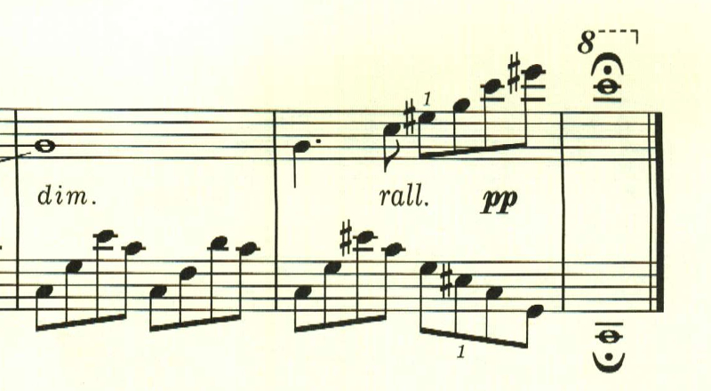
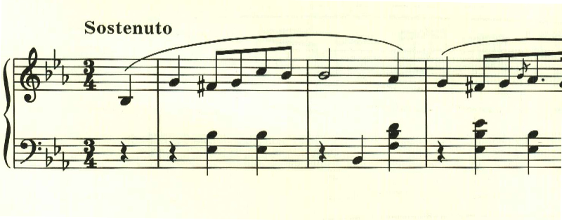
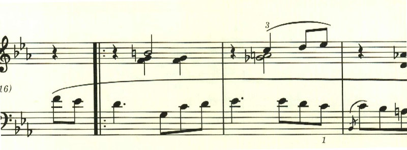

# ショパン ピアノ小品

## レント・コン・グラン・エスプレッシオーネ

<iframe height="175" width="100%" title="Media player" src="https://embed.music.apple.com/us/album/lento-con-gran-espressione-wn-37-c-sharp-minor/1234807634?i=1234807646&amp;itscg=30200&amp;itsct=music_box_player&amp;ls=1&amp;app=music&amp;mttnsubad=1234807646&amp;theme=auto" id="embedPlayer" style="border:0;border-radius:12px;width:100%;height:175px;max-width:660px" sandbox="allow-forms allow-popups allow-same-origin allow-scripts allow-top-navigation-by-user-activation" allow="autoplay *; encrypted-media *; clipboard-write"></iframe>

夜想曲20番として扱われていることが多い曲。エキエル版では"Lento con gran espressione"とのみ記載されており、ノクターンとは扱われていない。ショパンの姉が、ピアノ協奏曲第2番を練習する時のために書かれたと言われている。
曲は、晩秋の張り詰めた冷たい空気を思わせる印象的な和音の進行で始まる。

中間部は、左右でリズムの異なる謎かけのようなリズムで構成される。

一見難しそうだが、計算上は右手が三連符だと解釈すれば辻褄が合う。
最初のテーマが帰ってきた後、冷い風が吹き抜けるかのような連符が繰り返される。

最後は天に昇華していくかのように、消え入るように靜かに終わる。

楽譜引用はエキエル版

## ソステヌート(WN53)

<iframe height="175" width="100%" title="Media player" src="https://embed.music.apple.com/us/album/sostenuto-wn53-e-flat-major/1234807634?i=1234807645&amp;itscg=30200&amp;itsct=music_box_player&amp;ls=1&amp;app=music&amp;mttnsubad=1234807645&amp;theme=auto" id="embedPlayer" style="border:0;border-radius:12px;width:100%;height:175px;max-width:660px" sandbox="allow-forms allow-popups allow-same-origin allow-scripts allow-top-navigation-by-user-activation" allow="autoplay *; encrypted-media *; clipboard-write"></iframe>

エキエル版でWN53が振られた遺作。良くワルツ曲集に入っている(三拍子だからだろう)が、エキエル版では"Sostenuto"と題が付けられている。穏やかな午後を思わせるテーマで始まる。

後半も雰囲気は変わらない。通常だとD.C.を経て最初のテーマを繰り返すところだが、この曲では後半部を繰り返して靜かに終わる。

楽譜引用はエキエル版
